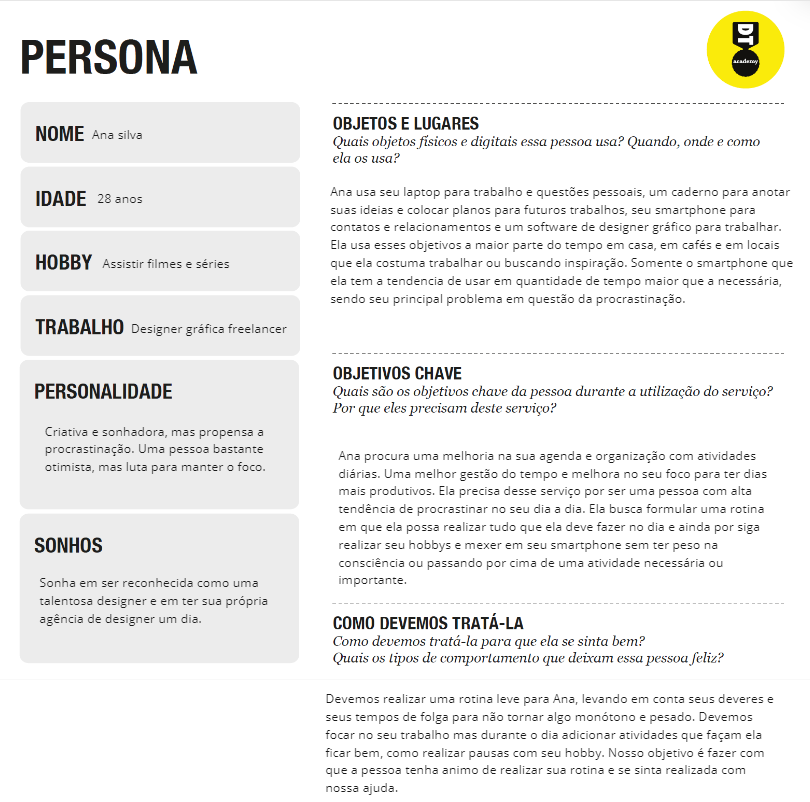
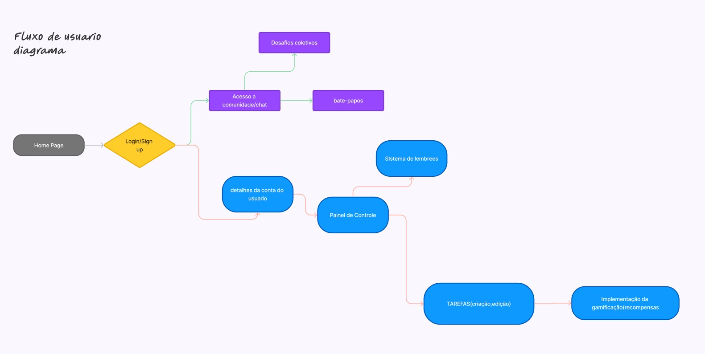

# Informações do Projeto
`TÍTULO DO PROJETO`  

......  PRODUTIVIFY  ......

`CURSO` 

......  Engenharia de Software ......

## Participantes

......  Os membros do grupo são: 
> - Thomás Ramos Oliveira
> - Pedro Henrique Ferraz Lima
> - Pedro Afonso Machado Vasconcelos
> - Pedro Oliveira Lanza
> - André Luíz Segato Ribeiro ......

# Estrutura do Documento

- [Informações do Projeto](#informações-do-projeto)
  - [Participantes](#participantes)
- [Estrutura do Documento](#estrutura-do-documento)
- [Introdução](#introdução)
  - [Problema](#problema)
  - [Objetivos](#objetivos)
  - [Justificativa](#justificativa)
  - [Público-Alvo](#público-alvo)
- [Especificações do Projeto](#especificações-do-projeto)
  - [Personas e Mapas de Empatia](#personas-e-mapas-de-empatia)
  - [Histórias de Usuários](#histórias-de-usuários)
  - [Requisitos](#requisitos)
    - [Requisitos Funcionais](#requisitos-funcionais)
    - [Requisitos não Funcionais](#requisitos-não-funcionais)
  - [Restrições](#restrições)
- [Projeto de Interface](#projeto-de-interface)
  - [User Flow](#user-flow)
  - [Wireframes](#wireframes)
- [Metodologia](#metodologia)
  - [Divisão de Papéis](#divisão-de-papéis)
  - [Ferramentas](#ferramentas)
  - [Controle de Versão](#controle-de-versão)
- [**############## SPRINT 1 ACABA AQUI #############**](#-sprint-1-acaba-aqui-)
- [Projeto da Solução](#projeto-da-solução)
  - [Tecnologias Utilizadas](#tecnologias-utilizadas)
  - [Arquitetura da solução](#arquitetura-da-solução)
- [Avaliação da Aplicação](#avaliação-da-aplicação)
  - [Plano de Testes](#plano-de-testes)
  - [Ferramentas de Testes (Opcional)](#ferramentas-de-testes-opcional)
  - [Registros de Testes](#registros-de-testes)
- [Referências](#referências)

# Introdução
A procrastinação é um fenômeno amplamente difundido que afeta a capacidade das pessoas de realizar suas tarefas
de forma eficaz e oportuna. Muitos indivíduos lutam diariamente contra o impulso de adiar atividades importantes,
resultando em estresse, ansiedade e insatisfação com seu próprio desempenho. Este projeto visa abordar essa
questão, fornecendo uma solução prática e acessível para ajudar as pessoas a superar a procrastinação e alcançar
seus objetivos com mais facilidade

## Problema

...... A procrastinação é um comportamento que pode ter consequências negativas em várias áreas da vida, incluindo
acadêmica, profissional e pessoal. As pessoas que procrastinam muitas vezes enfrentam dificuldades para cumprir
prazos, alcançar metas estabelecidas e manter um equilíbrio saudável entre trabalho e vida pessoal. Isso pode levar a
sentimentos de frustração, baixa autoestima e falta de realização. ......

## Objetivos

......  O objetivo principal deste projeto é desenvolver uma ferramenta digital que ajude os usuários a gerenciar sua
procrastinação de forma mais eficaz, fornecendo estratégias e recursos para melhorar sua produtividade e motivação.
Ao oferecer uma solução prática e personalizada, esperamos capacitar as pessoas a superar a procrastinação e
alcançar um maior sucesso em suas vidas pessoais e profissionais. ......

## Justificativa

......  A procrastinação é um problema generalizado que afeta pessoas de todas as idades e origens. Com o aumento das
demandas da vida moderna, como trabalho, estudos, família e compromissos sociais, é crucial encontrar maneiras de
gerenciar efetivamente o tempo e evitar a procrastinação. Ao desenvolver uma solução inovadora para esse problema,
esperamos contribuir para o bem-estar e a realização das pessoas, promovendo uma cultura de produtividade e
autoaperfeiçoamento ......

## Público-Alvo

...... Este projeto destina-se a indivíduos de todas as idades que lutam contra a procrastinação e desejam melhorar sua
produtividade e eficiência no cumprimento de suas tarefas diárias. Nosso público-alvo inclui estudantes universitários,
profissionais que trabalham em home office, empreendedores, freelancers e qualquer pessoa que busque uma maneira
eficaz de lidar com a procrastinação e alcançar seus objetivos de forma mais consistente. ......

Pessoas Fundamentais seriam os principais envolvidos no problema e representam os potenciais usuários de uma possível solução.
Ex do Uber: motoristas e passageiros
Pessoas Importantes são as pessoas que ajudam ou dificultam o desenvolvimento e uso da solução e que devem ser consideradas
Ex do Uber: taxistas, gov. locais, loja AppStore
Pessoas Influenciadoras são as pessoas ou entidades que devem ser consultadas para avaliar aspectos relevantes no ciclo de vida da solução.
Ex do Uber: Reguladores setor de transporte, opinião pública
 
# Especificações do Projeto

......  Será abordado a criação de uma rotina efetiva para uma pessoa com tedencia a uma rotina procrastinadora, iremos utilizar as questões de tecnicas que fazem com que a rotina não seja pesada e tenha ativiades que motivem a pessoa manter a rotina com uma visão positiva sobre ela. O principal ideal será diminuir ao máximo o costume de procrastinar, fazendo com que aumente o foco de quem sofre com esse problema.  ......

## Personas e Mapas de Empatia

......  > 
> ([Persona2](https://github.com/ICEI-PUC-Minas-PMGES-TI/pmg-es-2024-1-ti1-2010100-tiaw-procastinacao/assets/161331641/0d80ed59-6d8f-46de-85a1-87628f0c1e26) .....

## Histórias de Usuários

|EU COMO ANA SILVA   | QUERO/PRECISO DE UMA ROTINA EFETIVA|  PARA ACABAR COM MINHA PROCRASTINAÇÃO    |
|--------------------|------------------------------------|----------------------------------------  |
|Usuário do sistema  | Realizar minhas tarefas            | Realiza-las sem procrastinar                              |
|Administrador       | Ajudar o usuário                   | Criar uma rotina saudavel e sem chances de procrastinar   |

## Requisitos

### Requisitos Funcionais

|ID    | Descrição do Requisito  | Prioridade |
|------|-----------------------------------------|----|
|RF-001| Permitir que o usuário coloque suas atividades           | ALTA | 
|RF-002| Emitir uma mensagem do compromentimento no mês           | MÉDIA |

### Requisitos não Funcionais

|ID     | Descrição do Requisito  |Prioridade |
|-------|-------------------------|----|
|RNF-001| O sistema deve ser responsivo para rodar em um dispositivos móvel | ALTA | 
|RNF-002| Deve processar as realizações de atividades feitas pelo usuário |  ALTA | 

## Restrições

O projeto está restrito pelos itens apresentados na tabela a seguir.

|ID| Restrição                                             |
|--|-------------------------------------------------------|
|01| As atividades devem realizar no tempo idealizado |
|02| Não pode perder um certo número de atividades       |

# Projeto de Interface

......
Página Inicial:
|--| Menu com as opções do site.
|Calendário personalizado para a pessoa com suas atividades.| 

Página com menu:
|Colocar as atividades diárias das pessoas.|
|Anotar os hobbies e realizar uma rotina.|

Página de Calendário:
|Registrar uma rotina saudável e produtiva.|
|Adicionar lembretes e notificações para alertar a pessoa.|

Página Sobre:
|Informações sobre o propósito do site e contatos da equipe.|

Página de Login:
|Formulário de login e registro de usuários.
|Design intuitivo com menu de navegação consistente e rodapé informativo em todas as páginas.| ......

## User Flow

......    ......

## Wireframes

......   ......

# Metodologia

......  Adotamos uma abordagem ágil, combinando Design Thinking e Scrum. Iniciamos com empatia, definimos objetivos, geramos ideias, prototipamos e testamos com os usuários. Organizamos o trabalho em sprints de duas semanas, com reuniões diárias de acompanhamento. Utilizamos o GitHub para gestão de versões e colaboração. Ferramentas como Trello e Asana foram empregadas para acompanhamento e atribuição de tarefas. ......

## Divisão de Papéis

......  - **Desenvolvedor Frontend: Thomás Ramos Oliveira, João Pedro Fernandes Pinto Coelho
- **Desenvolvedor Backend: Pedro Afonso Machado Vasconcelos, André Luiz Segato Ribeiro
- **Designer UX/UI: Pedro Oliveira Lanza
- **Gerente de Projeto: Pedro Henrique Ferraz Lima ......

## Ferramentas

......  COLOQUE AQUI O SEU TEXTO - SIGA O EXEMPLO DA TABELA ABAIXO  ......

| Ambiente  | Plataforma              |Link de Acesso |
|-----------|-------------------------|---------------|
|Processo de Design Thinkgin  | Miro |(https://miro.com/welcomeonboard/cUZFa0phQUJ6M0w2NTdIV1JoMGgyenJkMXFYd1VyQTZIc3N4azdCSFFGY1QzdGdTdnoza0Y3SkZQYkJBellhMXwzNDU4NzY0NTg0MzMwMDkxNjMxfDI=?share_link_id=276740011535 ) | 
|Repositório de código | GitHub | https://github.com/ICEI-PUC-Minas-PMGES-TI/pmg-es-2024-1-ti1-2010100-tiaw-procastinacao | 
|Hospedagem do site | Heroku |  https://XXXXXXX.herokuapp.com | 
|Protótipo Interativo | MavelApp ou Figma | (https://www.figma.com/file/urvnoVN7FL3bWhKwyx3Mwy/Untitled?type=whiteboard&node-id=0%3A1&t=4IH873YirczSjuSP-1)  | 

>
> Liste as ferramentas empregadas no desenvolvimento do
> projeto, justificando a escolha delas, sempre que possível.
> 
> As ferramentas empregadas no projeto são:
> 
> - Editor de código.
> - Ferramentas de comunicação
> - Ferramentas de diagramação
> - Plataforma de hospedagem
> 
> O editor de código foi escolhido porque ele possui uma integração com o
> sistema de versão. As ferramentas de comunicação utilizadas possuem
> integração semelhante e por isso foram selecionadas. Por fim, para criar
> diagramas utilizamos essa ferramenta por melhor captar as
> necessidades da nossa solução.
> 
> **Links Úteis - Hospedagem**:
> - [Getting Started with Heroku](https://devcenter.heroku.com/start)
> - [Crie seu Site com o HostGator](https://www.hostgator.com.br/como-publicar-seu-site)
> - [GoDady](https://br.godaddy.com/how-to)
> - [GitHub Pages](https://pages.github.com/)

## Controle de Versão

......  ## Configuração do Projeto na Ferramenta de Versionamento (Git e GitHub)

### Estrutura do Repositório

O projeto foi configurado utilizando Git para controle de versão e GitHub para hospedagem do repositório upstream. A estrutura do repositório segue uma convenção clara de branchs para garantir a organização e o fluxo de trabalho. As principais branches e seus propósitos são:

- **master**: Contém a versão estável e já testada do software. É a branch de produção.
- **unstable**: Contém a versão já testada, porém ainda instável, do software.
- **testing**: Destinada para versões do software que estão em fase de testes.
- **dev**: Utilizada para desenvolvimento ativo do software.

### Gerência de Branchs

As branches são gerenciadas de acordo com o fluxo de trabalho Git Flow, adaptado às necessidades específicas do projeto. A criação e a manutenção das branches seguem as seguintes práticas:

- **master**: Atualizada apenas após a conclusão dos testes em outras branches e a confirmação de que a versão estável está pronta para lançamento.
- **unstable**: Atualizada após a conclusão dos testes na branch `testing`.
- **testing**: Atualizada a partir da branch `dev` quando uma nova funcionalidade ou correção está pronta para ser testada.
- **dev**: Atualizada frequentemente com commits de novas funcionalidades, melhorias e correções de bugs. Todos os desenvolvedores trabalham nessa branch, e é aqui que o desenvolvimento ativo ocorre.

### Gerência de Commits, Merges e Tags

#### Commits
Os commits são feitos de forma granular para garantir que cada mudança seja rastreável. As mensagens de commit seguem um padrão descritivo, incluindo informações como a funcionalidade alterada ou o bug corrigido. 

#### Merges
Os merges entre branches são realizados com cuidado para minimizar conflitos e garantir a integridade do código. O fluxo geral de merges é o seguinte:

- Alterações na branch `dev` são revisadas e, uma vez aprovadas, são mescladas na branch `testing`.
- Após a validação dos testes, as alterações são mescladas na branch `unstable`.
- Finalmente, após a estabilização e os testes finais, as alterações são mescladas na branch `master`.

#### Tags
As tags são usadas para marcar releases ou versões significativas do software. Segue-se uma convenção de nomeação de tags que reflete a versão do software, como `v1.0.0`, `v1.1.0`, etc. Isso facilita a rastreabilidade e a manutenção de versões específicas.

### Gerência de Issues

A gerência de issues é realizada diretamente no GitHub, utilizando o sistema de issues integrado. As issues são categorizadas usando etiquetas (labels) para facilitar a triagem e o gerenciamento. As principais etiquetas e suas descrições são:

- **bugfix**: Indica que uma funcionalidade está com problemas e precisa de correção.
- **enhancement**: Indica que uma funcionalidade existente precisa de melhorias.
- **feature**: Indica que uma nova funcionalidade precisa ser introduzida no software.

### Fluxo de Trabalho com Issues

1. **Criação de Issues**: Qualquer membro da equipe pode criar uma issue descrevendo o problema ou a funcionalidade desejada.
2. **Triagem de Issues**: As issues são revisadas periodicamente e etiquetadas de acordo com sua natureza (bugfix, enhancement, feature).
3. **Atribuição de Issues**: Issues são atribuídas a desenvolvedores específicos que são responsáveis por resolver o problema ou implementar a funcionalidade.
4. **Desenvolvimento e Referência de Commits**: Durante o desenvolvimento, os desenvolvedores fazem commits referenciando a issue correspondente (usando `#issue_number` nas mensagens de commit) para manter o rastreamento claro.
5. **Revisão e Fechamento de Issues**: Após a implementação e teste, as issues são revisadas. Se a solução for aprovada, a issue é fechada.

### Conclusão

A configuração do projeto no Git e GitHub é estruturada para garantir um desenvolvimento organizado e eficiente. O uso de convenções claras para branches, a gerência cuidadosa de commits, merges e tags, e a sistemática de issues com etiquetas bem definidas contribuem para a manutenção da qualidade e a facilitação do trabalho colaborativo na equipe.

> Discuta como a configuração do projeto foi feita na ferramenta de
> versionamento escolhida. Exponha como a gerência de tags, merges,
> commits e branchs é realizada. Discuta como a gerência de issues foi
> realizada.
> A ferramenta de controle de versão adotada no projeto foi o
> [Git](https://git-scm.com/), sendo que o [Github](https://github.com)
> foi utilizado para hospedagem do repositório `upstream`.
> 
> O projeto segue a seguinte convenção para o nome de branchs:
> 
> - `master`: versão estável já testada do software
> - `unstable`: versão já testada do software, porém instável
> - `testing`: versão em testes do software
> - `dev`: versão de desenvolvimento do software
> 
> Quanto à gerência de issues, o projeto adota a seguinte convenção para
> etiquetas:
> 
> - `bugfix`: uma funcionalidade encontra-se com problemas
> - `enhancement`: uma funcionalidade precisa ser melhorada
> - `feature`: uma nova funcionalidade precisa ser introduzida
>
> **Links Úteis**:
> - [Tutorial GitHub](https://guides.github.com/activities/hello-world/)
> - [Git e Github](https://www.youtube.com/playlist?list=PLHz_AreHm4dm7ZULPAmadvNhH6vk9oNZA)
> - [5 Git Workflows & Branching Strategy to deliver better code](https://zepel.io/blog/5-git-workflows-to-improve-development/)
>
> **Exemplo - GitHub Feature Branch Workflow**:
>
> 

# **############## SPRINT 1 ACABA AQUI #############**

# Projeto da Solução

......  Objetivo do Projeto
Desenvolver uma aplicação web que ajude os usuários a gerenciar suas tarefas diárias de forma eficiente, oferecendo recursos avançados de produtividade e gamificação para combater a procrastinação.

Funcionalidades Principais
Autenticação e Login:

Os usuários devem poder se cadastrar e fazer login para acessar suas tarefas e recursos personalizados.
Gerenciamento de Tarefas:

Criação, Edição e Exclusão de Tarefas: Permitir aos usuários adicionar novas tarefas à sua lista, editar informações existentes e excluir tarefas concluídas ou desnecessárias.
Recursos de Planejamento e Produtividade:

Listas de Verificação: Permitir aos usuários criar e gerenciar listas de verificação para diferentes projetos ou atividades.
Calendário Integrado: Integrar um calendário para visualizar e agendar tarefas com prazos específicos.
Técnicas de Pomodoro: Implementar um temporizador para a técnica de Pomodoro, dividindo o trabalho em períodos de foco e descanso.
Gamificação:

Sistema de Pontuação e Recompensas: Ao completar tarefas ou atingir metas, os usuários serão recompensados com pontos que podem ser trocados por distintivos virtuais ou outras recompensas.
Desafios e Missões: Oferecer desafios diários ou semanais, missões especiais e eventos temáticos para incentivar a participação regular e engajamento dos usuários.
Painel de Controle e Estabelecimento de Metas:

Dashboard Personalizado: Fornecer um painel de controle que exiba métricas de progresso, estatísticas de desempenho e ferramentas para estabelecer metas realistas e alcançáveis.
Gráficos Visuais e Badges: Incluir gráficos visuais para acompanhar o progresso e badges que os usuários podem ganhar ao atingir determinados marcos.
Comunidade Online:

Fóruns de Discussão e Grupos de Interesse: Criar uma plataforma onde os usuários podem interagir, compartilhar experiências, trocar dicas e oferecer apoio mútuo.
Desafios Coletivos e Eventos Comunitários: Organizar desafios e eventos temáticos que incentivem a participação ativa da comunidade e promovam um ambiente de suporte e motivação. ......

## Tecnologias Utilizadas

...... 
HTML5, CSS3, JavaScript: Linguagens fundamentais para estruturação, estilização e interatividade da interface do usuário.
Bootstrap: Framework front-end para desenvolvimento de interfaces responsivas e estilizadas de forma consistente.
Chart.js: Biblioteca JavaScript para criação de gráficos interativos na interface do usuário.

Backend:
Node.js: Ambiente de execução do servidor backend.

Ferramentas e IDEs:
Visual Studio Code (VS Code): IDE de desenvolvimento preferida para codificação, depuração e controle de versão.
Git: Sistema de controle de versão para colaboração e gerenciamento de código-fonte.
Postman: Ferramenta para testar APIs e realizar requisições HTTP.
Figma ou Adobe XD: Ferramentas para criação de wireframes, protótipos de tela e design de interface.

]COLOQUE AQUI O SEU TEXTO ......

> Descreva aqui qual(is) tecnologias você vai usar para resolver o seu
> problema, ou seja, implementar a sua solução. Liste todas as
> tecnologias envolvidas, linguagens a serem utilizadas, serviços web,
> frameworks, bibliotecas, IDEs de desenvolvimento, e ferramentas.
> Apresente também uma figura explicando como as tecnologias estão
> relacionadas ou como uma interação do usuário com o sistema vai ser
> conduzida, por onde ela passa até retornar uma resposta ao usuário.
> 
> Inclua os diagramas de User Flow, esboços criados pelo grupo
> (stoyboards), além dos protótipos de telas (wireframes). Descreva cada
> item textualmente comentando e complementando o que está apresentado
> nas imagens.

## Arquitetura da solução

......  Nossa solução foi desenvolvida utilizando um conjunto de tecnologias modernas para garantir eficiência, usabilidade e integração.

JavaScript: Utilizado para a lógica de interação do usuário e manipulação do DOM.
HTML e CSS: Responsáveis pela estruturação e estilização da interface da aplicação.
JSON: Utilizado para o armazenamento de dados estruturados, como configurações de usuário e tarefas.
APIs Externas: Integração com APIs externas para funcionalidades como sincronização de calendários e gestão de usuários.
Chart.js: Biblioteca JavaScript para a criação de gráficos interativos na interface do usuário.
Bootstrap: Framework front-end utilizado para desenvolver interfaces responsivas e estilizadas de forma consistente.

E O DIAGRAMA DE ARQUITETURA .......

> Inclua um diagrama da solução e descreva os módulos e as tecnologias
> que fazem parte da solução. Discorra sobre o diagrama.
> 
> **Exemplo do diagrama de Arquitetura**:
> 
> 

# Avaliação da Aplicação

......  Durante a avaliação da nossa aplicação, focamos em diversos cenários de teste que demonstram a eficácia em atender aos requisitos estabelecidos. Abaixo estão os detalhes dos cenários de teste selecionados:

Cenários de Teste:

Cadastro e Gerenciamento de Tarefas:

Descrição: Os usuários foram solicitados a cadastrar novas tarefas no sistema, incluindo detalhes como título, descrição, data de vencimento e prioridade.
Objetivo: Verificar a facilidade de uso e a completude dos dados necessários para uma tarefa.
Visualização e Navegação no Painel de Controle:

Descrição: Os usuários exploraram o painel de controle para visualizar suas tarefas pendentes, prazos e status de conclusão.
Objetivo: Avaliar a clareza da apresentação das informações e a facilidade de navegação entre diferentes seções do painel.
Interação com Recursos de Gamificação:

Descrição: Os usuários participaram de desafios e utilizaram recompensas disponíveis na aplicação.
Objetivo: Testar a capacidade da gamificação em motivar os usuários e aumentar o engajamento na realização das tarefas.
 ......

> Apresente os cenários de testes utilizados na realização dos testes da
> sua aplicação. Escolha cenários de testes que demonstrem os requisitos
> sendo satisfeitos.

## Plano de Testes

......  Durante a fase de testes, nos concentramos em avaliar diversas funcionalidades chave da nossa solução. Abaixo estão os detalhes das áreas avaliadas e os cenários de teste selecionados:

Cadastro de Atividades:
O processo de cadastro de atividades foi meticulosamente testado para avaliar a facilidade de uso e a eficiência em inserir novas tarefas no sistema. Os usuários foram solicitados a registrar uma variedade de tarefas com diferentes níveis de complexidade e detalhamento.

Painel de Controle:
O painel de controle foi examinado quanto à sua capacidade de oferecer uma visão consolidada das tarefas pendentes, prazos e status de conclusão. A organização e a apresentação das informações foram critérios fundamentais durante a avaliação.

Gamificação:
A funcionalidade de gamificação foi avaliada quanto à sua capacidade de motivar os usuários por meio de recompensas, desafios e feedback visual. Foi analisado como esses elementos influenciam o engajamento e a consistência na utilização da plataforma.

Cenários de Teste Selecionados
Funcionalidades Avaliadas:

Cadastro de novas tarefas com diferentes detalhamentos.
Navegação e uso do painel de controle para gerenciar tarefas.
Interação com elementos de gamificação, como recompensas e desafios.
Grupo de Usuários:
O grupo selecionado para participar dos testes foi composto por profissionais de diversas áreas, incluindo estudantes universitários, freelancers e profissionais corporativos. Essa diversidade permitiu capturar diferentes perspectivas e necessidades de uso da plataforma.

Ferramentas Utilizadas:
Durante os testes, foram utilizadas ferramentas de feedback instantâneo e análise de comportamento do usuário para coletar dados quantitativos e qualitativos. Além disso, realizamos entrevistas estruturadas e questionários para obter insights detalhados sobre a experiência dos usuários. ......

> Enumere quais cenários de testes foram selecionados para teste. Neste
> tópico o grupo deve detalhar quais funcionalidades avaliadas, o grupo
> de usuários que foi escolhido para participar do teste e as
> ferramentas utilizadas.
> 
> **Links Úteis**:
> - [IBM - Criação e Geração de Planos de Teste](https://www.ibm.com/developerworks/br/local/rational/criacao_geracao_planos_testes_software/index.html)
> - [Práticas e Técnicas de Testes Ágeis](http://assiste.serpro.gov.br/serproagil/Apresenta/slides.pdf)
> -  [Teste de Software: Conceitos e tipos de testes](https://blog.onedaytesting.com.br/teste-de-software/)

## Ferramentas de Testes (Opcional)

......  COLOQUE AQUI O SEU TEXTO ......

> Comente sobre as ferramentas de testes utilizadas.
> 
> **Links Úteis**:
> - [Ferramentas de Test para Java Script](https://geekflare.com/javascript-unit-testing/)
> - [UX Tools](https://uxdesign.cc/ux-user-research-and-user-testing-tools-2d339d379dc7)
> - [Teste de Compatibilidade com Dispositivos Móveis](https://search.google.com/test/mobile-friendly )
> - [PageSpeed Insights](https://pagespeed.web.dev/ )
> - [Site Navigability Analyzer](https://datayze.com/site-navigability-analyzer )
> - [Online Broken Link Checker](https://www.brokenlinkcheck.com/ )
> - [Lighthouse](https://developer.chrome.com/docs/lighthouse/overview/ )

## Registros de Testes

......  Pontos Fortes:

Facilidade de Registro de Tarefas: Os usuários destacaram positivamente a facilidade de cadastrar e organizar tarefas no sistema. A interface intuitiva e a capacidade de inserir rapidamente novas atividades foram pontos fortes mencionados repetidamente.

Visualização Clara e Concisa: A apresentação das tarefas e dos prazos associados foi considerada clara e concisa, facilitando o acompanhamento das atividades pendentes e concluídas.

Integração com Outras Ferramentas: A capacidade de integração com outras ferramentas e aplicativos de produtividade foi valorizada, permitindo uma sincronização eficiente de dados e uma experiência mais fluida para o usuário.

Pontos Fracos:

Falta de Incentivo à Consistência: Uma das principais críticas foi a falta de recursos que incentivem a consistência e disciplina do usuário ao longo do tempo. Muitos testadores mencionaram que, embora seja fácil iniciar e registrar tarefas, manter uma rotina constante de uso foi um desafio.

Complexidade em Funcionalidades Avançadas: Alguns usuários relataram dificuldades ao explorar funcionalidades mais avançadas do sistema, como a configuração de lembretes personalizados ou a utilização de etiquetas para categorização de tarefas.

Estratégias para Próximas Iterações
Para abordar esses pontos nas próximas iterações do desenvolvimento, nosso grupo planeja implementar as seguintes melhorias:

Gamificação e Incentivos: Introduzir elementos de gamificação, como recompensas por metas cumpridas e lembretes automáticos para incentivar a consistência na utilização diária da plataforma.

Simplificação e Educação do Usuário: Simplificar a interface em áreas onde houve feedback de complexidade excessiva, além de oferecer tutoriais e guias mais claros para explorar funcionalidades avançadas.

Feedback Contínuo e Ajustes Rápidos: Estabelecer um canal de feedback mais robusto para os usuários, garantindo ajustes rápidos com base nas sugestões recebidas durante os testes. ......

> Discorra sobre os resultados do teste. Ressaltando pontos fortes e
> fracos identificados na solução. Comente como o grupo pretende atacar
> esses pontos nas próximas iterações. Apresente as falhas detectadas e
> as melhorias geradas a partir dos resultados obtidos nos testes.

# Referências

...... A Tríade do Tempo: Um modelo estratégico para organizar sua vida" - Christian Barbosa. Editora: Sextante, 2014.

"O Poder do Hábito: Por que fazemos o que fazemos na vida e nos negócios" - Charles Duhigg. Editora: Objetiva, 2012.

"Produtividade para Quem Quer Tempo: Aprenda a produzir mais sem ter que trabalhar mais" - Geronimo Theml. Editora: Gente, 2020.

"Mude seus Horários, Mude sua Vida: Estratégias de mudança para vida, trabalho, saúde e relacionamentos" - Dr. Suhas Kshirsagar. Editora: Alaúde, 2019. ......

> Inclua todas as referências (livros, artigos, sites, etc) utilizados
> no desenvolvimento do trabalho.
> 
> **Links Úteis**:
> - [Formato ABNT](https://www.normastecnicas.com/abnt/trabalhos-academicos/referencias/)
> - [Referências Bibliográficas da ABNT](https://comunidade.rockcontent.com/referencia-bibliografica-abnt/)
